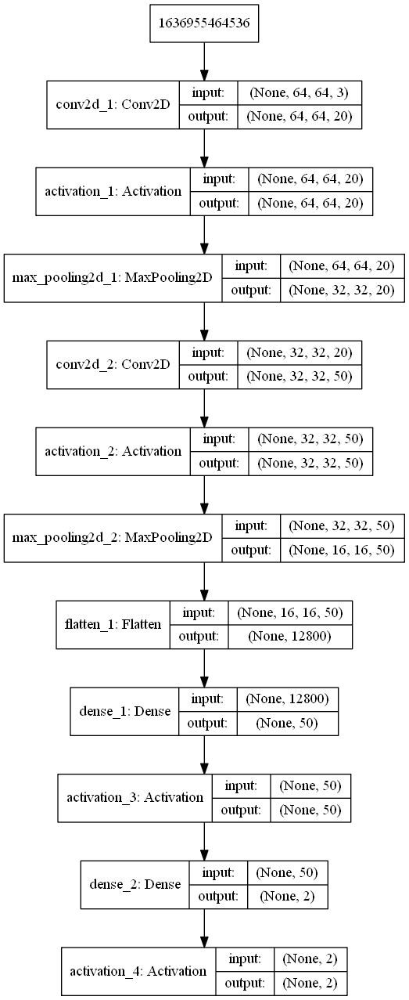

# Project Turing

This repository hosts the digital artefects from an investigation of the effects of medical image augmentation on the robustness of convolutional neural networks as part of the BSc (Hons) Computer Science (Artificial Intelligence) Dissertation Project.

### Installation
You can download the project from this repository and use the contents [demo](demo/) to run a scaled-down version of the dataset and pre-configured demonstration of how image rotation and noise augmentation affects the network during training.
Results of the demo training are saved in he respective [demo-results](demo/demo-results) folder.

### Results
Experimental results from various runs can be found in the [results](results/) directory. Those contain training and validation graphs as well as saved network model structures. (Unfortunately not all weights have been saved from initial experiments).
* [Density-Change](results/density-change/) contains the results from varying the density of network layers.
* [Image-Augmentation-Experiments](results/image-augmentation-experiments/) contains the results from initial image augmentation experimentation.
* [Learning-Rate](results/learning-rate/) contains the results from varying the network's learning rate.
* [Animal-Noise-Experiments](results/animal-noise-experiments/) contains the results from using a 'toy' animal dataset (not used in the final medical dataset conclusions).
* [Cancer-Noise-Experiments](results/cancer-noise-experiments/) contains the results from noise augmentation on the medical (cancer) dataset.
* [Cancer-Rotation-Experiments](results/cancer-rotation-experiments/) contains the results from rotation augmentation on the medical (cancer) dataset.
* [Noise-Experiments](results/noise-experiments/) and [Rotation-Experiments](results/rotation-experiments/) contain miscalenous results from noise and rotation experimentats.

### Tools
The [tools](tools/) directory contains various tools used during the preparation of the datasets, directory creation etc.

### Main Network
The core network structure, merged from two separate branches, can be found in the [binary-classifier-network.py](binary-classifier-network.py) file, and its respective versions in general experiments branches. It is intended as a master-file and might not compile properly. For runnable samples see the [demo](demo/) directory.

High-level overview of the network structure can be seen below:


Network Summary:
```
_________________________________________________________________
Layer (type)                 Output Shape              Param #
=================================================================
conv2d_1 (Conv2D)            (None, 64, 64, 20)        1520
_________________________________________________________________
activation_1 (Activation)    (None, 64, 64, 20)        0
_________________________________________________________________
max_pooling2d_1 (MaxPooling2 (None, 32, 32, 20)        0
_________________________________________________________________
conv2d_2 (Conv2D)            (None, 32, 32, 50)        25050
_________________________________________________________________
activation_2 (Activation)    (None, 32, 32, 50)        0
_________________________________________________________________
max_pooling2d_2 (MaxPooling2 (None, 16, 16, 50)        0
_________________________________________________________________
flatten_1 (Flatten)          (None, 12800)             0
_________________________________________________________________
dense_1 (Dense)              (None, 50)                640050
_________________________________________________________________
activation_3 (Activation)    (None, 50)                0
_________________________________________________________________
dense_2 (Dense)              (None, 2)                 102
_________________________________________________________________
activation_4 (Activation)    (None, 2)                 0
=================================================================
Total params: 666,722
Trainable params: 666,722
Non-trainable params: 0
_________________________________________________________________
```
