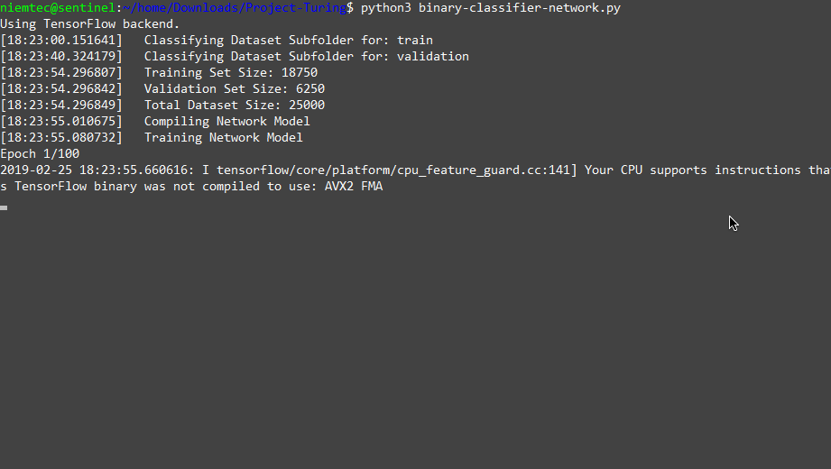
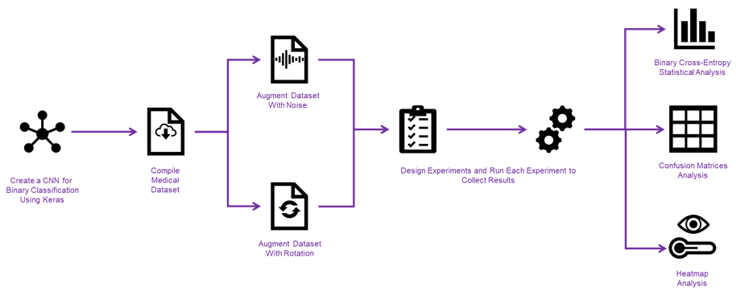
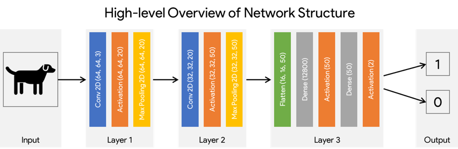
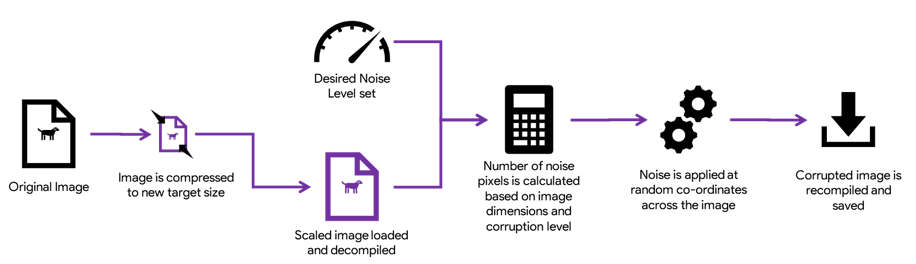
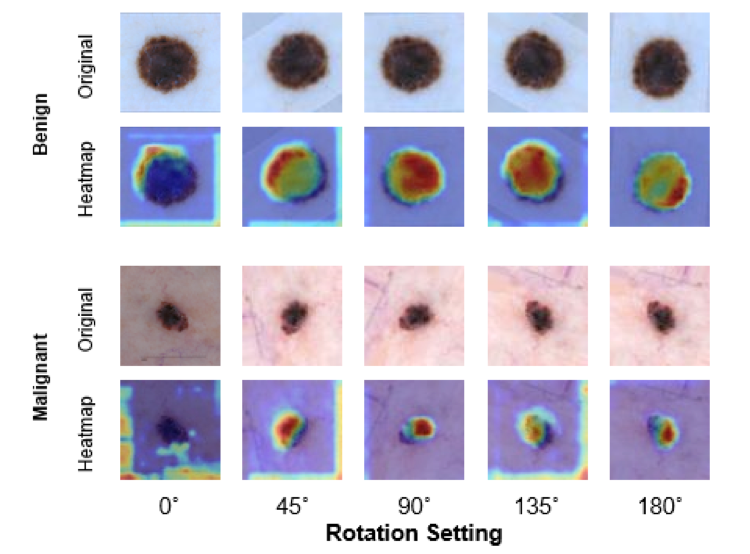

# Effects of Image Augmentation on Convolutional Neural Networks
An investigation into the effects that image augmentation has on the accuracy and loss of Convolutional Neural Networks. *This work was completed as part of dissertation project for Bachelor of Science (Honours) in Computer Science with specialism in Artificial Intelligence.*

*The summarised research notes can be found [here](github-pages/Investigation of the Effects of Medical Image Augmentation on the Robustness of Convolutional Neural Networks - A summary of Undergraduate Dissertation in Computer Science with Artificial Intelligence.pdf)*.

## Project Aims

To generate a series of augmented dataset samples using **rotation** and **noise** and compare the effects that augmented samples have on model performance. Performance is measured in terms of general model **accuracy** and **loss** as reported by [Keras](https://keras.io/), with further calculations of **precision** and **error** rates derived through the use of [confusion matrices](https://www.dataschool.io/simple-guide-to-confusion-matrix-terminology/).

Varying factor of image augmentation is used in model training and/or testing (depending on the experiment performed) to determine how it affects the model's ability to correctly classify samples.

## CNN Model

The Convolutional Neural Network Model used is based on the LeNet architecture design with some modifications necessary to achieve a reliable classification rate. It consists of 666,722 trainable parameters distributed across the following layers:

| Layer Type                    | Output Shape       | No. of Parameters |
|-------------------------------|--------------------|-------------------|
| conv2d_1 (Conv2D)             | (None, 64, 64, 20) | 1520              |
| activation_1 (Activation)     | (None, 64, 64, 20) | 0                 |
| max_pooling2d_1 (MaxPooling2) | (None, 32, 32, 20) | 0                 |
| conv2d_2 (Conv2D)             | (None, 32, 32, 50) | 25050             |
| activation_2 (Activation)     | (None, 32, 32, 50) | 0                 |
| max_pooling2d_2 (MaxPooling2) | (None, 16, 16, 50) | 0                 |
| flatten_1 (Flatten)           | (None, 12800)      | 0                 |
| dense_1 (Dense)               | (None, 50)         | 640050            |
| activation_3 (Activation)     | (None, 50)         | 0                 |
| dense_2 (Dense)               | (None, 2)          | 102               |
| activation_4 (Activation)     | (None, 2)          | 0                 |

## Dataset
The experiment focussed on binary classification of cancer samples (either as malignant or benign) based on the [International Skin Imaging Collaboration (ISIC) Archive](https://isic-archive.com/). The archive containins samples of high-quality images of nevi (skin moles) from both healthy patients and those with various types of cancer, to convert this dataset from a multi-variate classification to a binary classification the samples have been cut down to a single cancer sub-type.

The final dataset contained 1080 benign and 1080 malignant samples. Total sample number of 2160.
Selected dataset is then split into 1620 (75%) training samples and 540 (25%) validation samples.

*Note: The main hinderance of this project is the limited dataset size which translates to a limited ultimate accuracy achievable by the network*

## Experiment Results
The model was trained over 100 epochs for each experiement variation using continuous integration TeamCity server.

### Network Structure Variation Results
Initial results from varying network structure and hyper parameters can be found in the [learning rate](experiment-results/Learning-Rate-Variations-Results) and [network density](experiment-results/Network-Density-Change-Variation-Results) result directories. Each containing the accuracy and loss graphs at varying parameter setting for the given investigation.

Once the optimal trade-off has been selected, the finalised parameters were used in all of the following experiments.

### Cancer Noise Augmentation Results

Noise augmentation has been applied to the images at varying settings ranging from 0% (control data with no noise) to 15% (maximum corruption in experimental design) with a 5% increase between stages (0%, 5%, 10%, 15%).

The results can be found [here](experiment-results/Cancer-Noise-Experiment-Results).

### Cancer Rotation Augmentation Results
Rotation augmentation has been applied to the samples at various settings using a built-in Keras library function for pre-processing the images on-the-fly as they are fed into the network model.
The rotations were applied from 0° to 180° at 45° incremenets (0°, 45°, 90°, 135°, 180°).

The results can be found [here](experiment-results/Cancer-Rotation-Experiment-Results).

### Network Activation Heatmaps

To support the experimental results above, heatmaps were generated which highlight the areas of focus for the model. They demonstrate which areas of the image the network focuses on through a "thermal" overaly atop the original sample.

Heatmaps for [noise experiments can be found here](experiment-results/Cancer-Noise-Experiment-Heatmaps) and [rotation experiments here](experiment-results/Cancer-Rotation-Experiment-Heatmaps).

## Augmentation Methods
Images have been augmented to a varying degree using the following methods.

### Noise Augmentation
Noise has been artificially added to the sample image using black pixels; an augmentation factor determines the percentage of pixels to affect in an image of size X*Y.
Black pixels are then placed at random locations along the X and Y axis of the image. New, augmented, image is then saved for model training and testing.

### Rotation Augmentation
Rotation utilises in-built Keras libraries and loads original images from the dataset directories, rotating them prior to being fed into the model. Rotation degree represents the rotation between positive and negative rotation of the image. 
For example, an image set to 45° would rotate to a random position between -45° to 45°.

## Tools
The [tools](tools/) directory contains various tools used during the preparation of datasets, directory creation, extraction of model heatmaps, visualisation and image reallocation. 

## Credits
The team behind the **Grad-CAM** tool as demonstrated in the paper ["Grad-CAM: Visual Explanations from Deep Networks via Gradient-based Localization"](https://arxiv.org/abs/1610.02391) made heatmap visualisation prossible.

[The International Society for Digital Imaging of the Skin](https://isdis.net/isic-project) made their dataset publicly available for research purposes. The archive used in this investigation can be found [here](https://www.isic-archive.com/).
